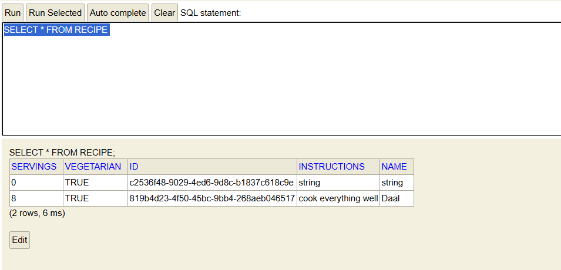
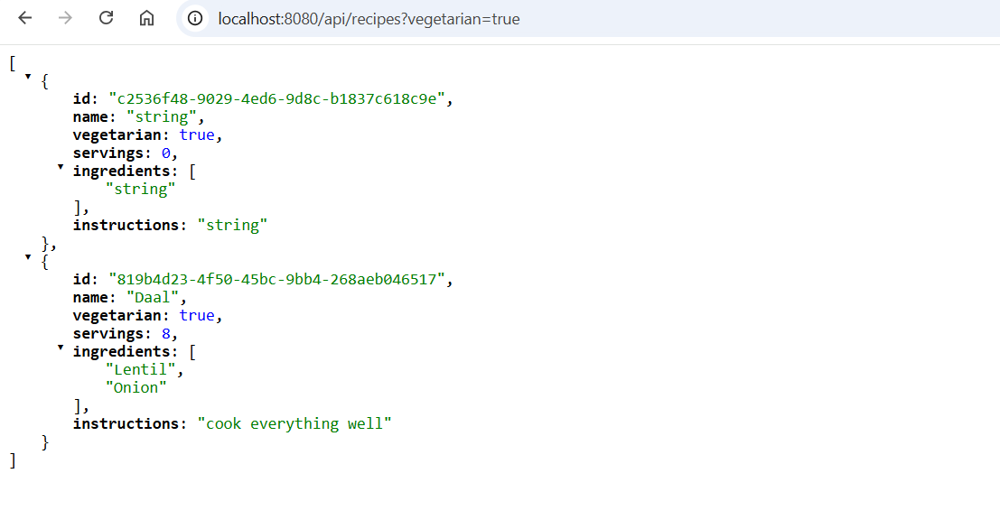
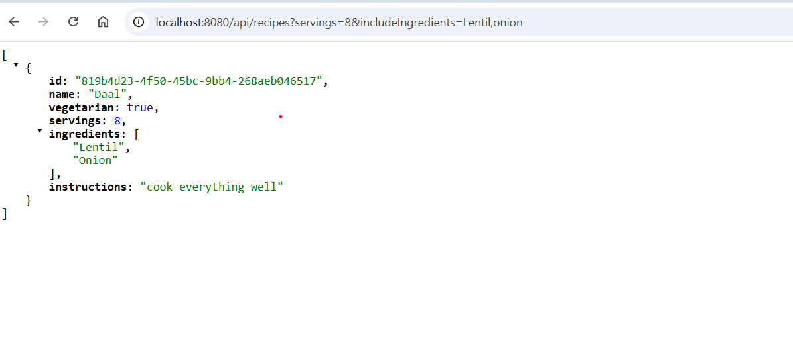

# Recipe Service 🍽️

A production-ready Spring Boot REST API that allows users to manage and search their favourite recipes efficiently.

The application supports creating, deleting, fetching, and **advanced filtering** of recipes based on dietary preferences and content, while keeping the design simple, readable, and extensible.

---

## 📌 Features

- Create, retrieve, and delete recipes
- Filter recipes by:
    - Vegetarian / non-vegetarian
    - Number of servings
    - Included ingredients
    - Excluded ingredients
    - Text search within cooking instructions
- In-memory persistence using H2
- Fully documented REST API via Swagger/OpenAPI
- Clean layered architecture
- Unit tests and integration tests
- Ready to import and run in IntelliJ IDEA

---

## 🧱 Architecture Overview

The application follows a **clean layered architecture**:


### Layers
- **Controller layer**  
  Handles HTTP requests and responses. No business logic.
- **Service layer**  
  Contains business logic and orchestration.
- **Repository layer**  
  Uses Spring Data JPA for database access.
- **Domain layer**  
  JPA entities and value objects.

This separation improves:
- Readability
- Testability
- Maintainability
- Long-term extensibility

---

## 🛠️ Technology Stack & Rationale

### Java 17
- LTS version
- Strong ecosystem support
- Modern language features

### Spring Boot
- Industry standard for building RESTful services
- Auto-configuration reduces boilerplate
- Strong testing support

### Spring Data JPA
- Clean abstraction over persistence
- Specification API allows flexible filtering without complex SQL
- Database-agnostic

### H2 Database (In-Memory)
- Zero external dependencies
- Fast startup
- Ideal for demos, development, and CI
- Easy inspection using H2 Console

### Maven
- Widely adopted build tool
- Clear dependency management
- Simple project import into IntelliJ

### Swagger / OpenAPI (springdoc-openapi)
- Self-documenting API
- Easy manual testing via browser
- Improves developer experience

### JUnit 5 + Spring Boot Test
- Modern testing framework
- Supports unit and integration testing
- Ensures correctness and regressions prevention

---

## ▶️ Running the Application

### Prerequisites
- Java 17+
- Maven 3.8+

### Steps

At the **parent directory level**  
(i.e. directory `vvyavahare-recipe-service`):

```bash
mvn spring-boot:run
```


swagger UI : http://localhost:8080/swagger-ui/index.html#


Get all recipes -> http://localhost:8080/api/recipes/all

More Examples: 

    GET http://localhost:8080/api/recipes?vegetarian=true

    GET http://localhost:8080/api/recipes?servings=4&includeIngredients=spice,oil,fish

    GET http://localhost:8080/api/recipes?servings=4&excludeIngredients=oil,onion,tomato


H2-Console:
http://localhost:8080/h2-console









